  

  <a href="https://www.polytraderbot.com/"><strong>PolyTraderBot</strong></a>
  &nbsp;·&nbsp;
  <a href="https://svaroglauncher.com/"><strong>Svarog Launcher</strong></a>
  &nbsp;·&nbsp;
  <a href="https://github.com/krutftw/audit-portfolio"><strong>Security research</strong></a>
  &nbsp;·&nbsp;
  <a href="https://x.com/Tradi3_"><strong>X</strong></a>

I am **Tradi3**. I build trading software and spend the rest of my time looking for ways smart contracts can fail.

<table>
  <tr>
    <td width="50%" valign="top">
      <h3>BUILD // systems</h3>
      

        <a href="https://www.polytraderbot.com/"><strong>PolyTraderBot</strong></a> 
        Owner / builder · self-hosted trading automation for Polymarket.
      

      

        <a href="https://svaroglauncher.com/"><strong>Svarog Launcher</strong></a> 
        Lead developer · Solana token-launching and bundling infrastructure.
      

      

        <a href="https://github.com/krutftw/bitcoin09"><strong>Bitcoin 09</strong></a> 
        A no-premine, CPU proof-of-work network with a 21 million coin cap.
      

    </td>
    <td width="50%" valign="top">
      <h3>BREAK // assumptions</h3>
      
I review DeFi contracts at the seams: accounting, AMMs, oracle paths, access boundaries, and contract lifecycle edge cases.

      

        <a href="https://github.com/krutftw/audit-portfolio"><strong>Open the security research log →</strong></a> 
        Only finalized, publicly verifiable work is listed.
      

      

        <a href="https://github.com/krutftw/bounty-operator-kit"><strong>Bounty Operator Kit</strong></a> 
        My open-source workflow for scope, PoCs, duplicate checks, and report preparation.
      

    </td>
  </tr>
</table>

### `PROOF / PUBLIC RECORD`

| Review | Result | Placement | Record |
| --- | --- | --- | --- |
| Revert Finance · StableSwap Hooks | 1 High · 1 Medium | 56 / 269 | [Cantina](https://cantina.xyz/competitions/e55ee7b9-6c99-42f8-8338-39f3dd134ef3/leaderboard) |
| Base Azul | 1 valid Med/Low · $367 | 53rd | [Immunefi](https://immunefi.com/audit-competition/audit-comp-base-azul/leaderboard/) |
| Metric | 3 Mediums · 1.66 USDC | 24th | [Sherlock](https://audits.sherlock.xyz/watson/Tradi3) |
| Tare | 2.61 USDC payout | 172nd | [Sherlock](https://audits.sherlock.xyz/watson/Tradi3) |

  <a href="https://audits.sherlock.xyz/watson/Tradi3">Sherlock</a>
  &nbsp;·&nbsp;
  <a href="https://cantina.xyz/u/Tradi3">Cantina</a>
  &nbsp;·&nbsp;
  <a href="https://github.com/krutftw/audit-portfolio">Audit portfolio</a>

<code>BUILD → TRACE → BREAK → PROVE</code>

